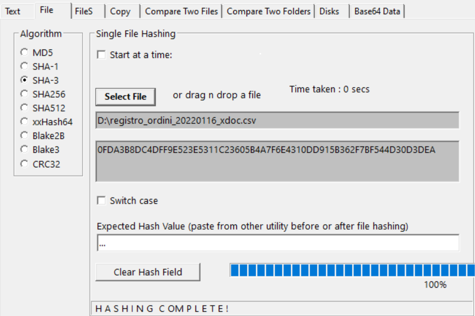
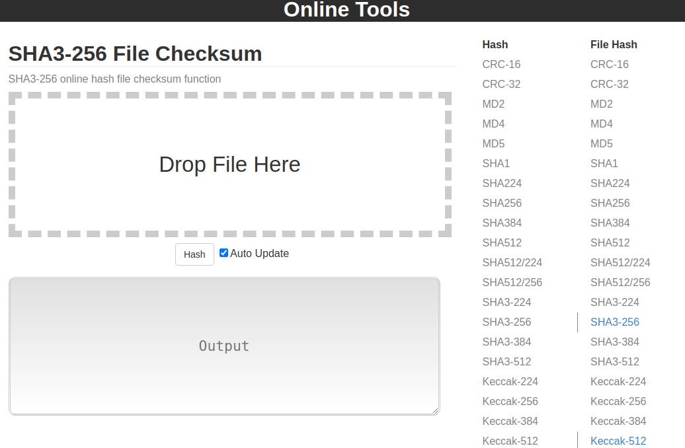
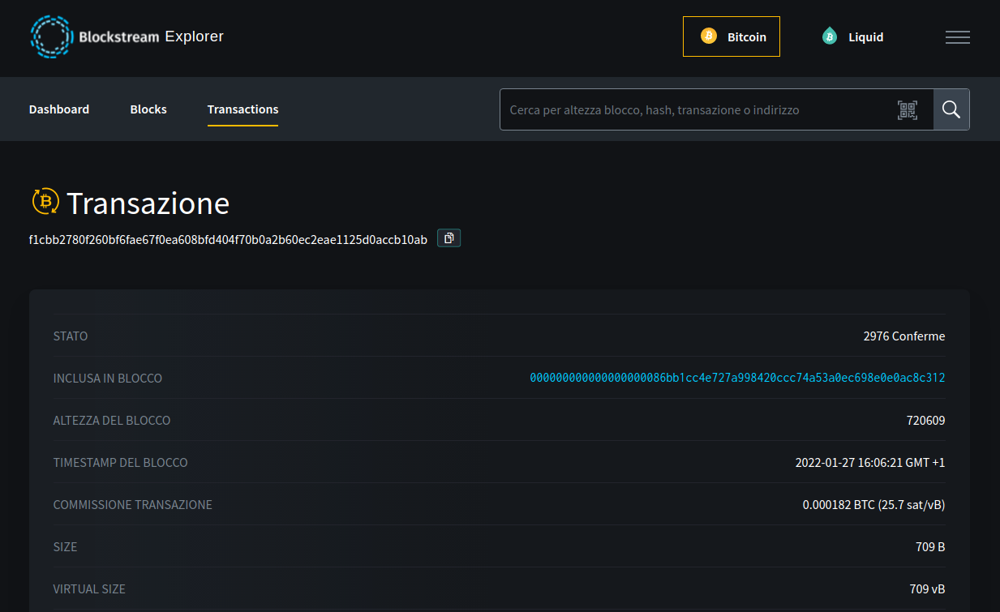
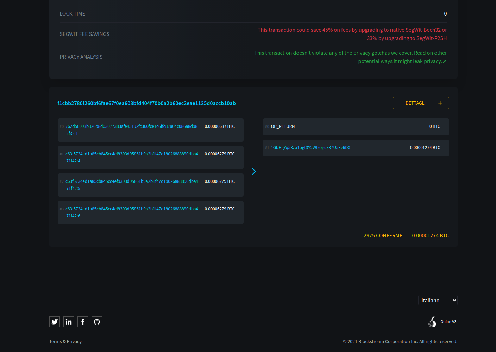
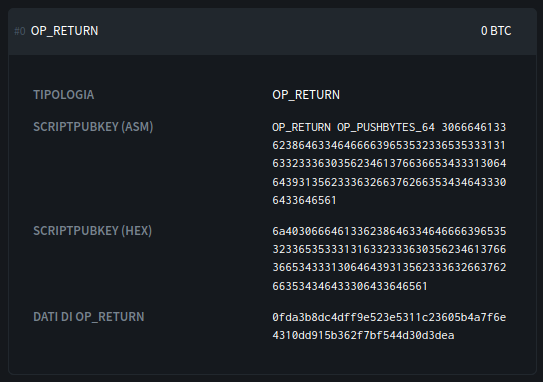

  


# Istruzioni per la verifica autonoma su Blockchain della notarizzazione del registro ordini

## 1	Introduzione
In questo documento è descritta la procedura per la verifica manuale dell'avvenuta notarizzazione del Registro Ordini (RO) sulla blockchain di Bitcoin. 

La blockchain è un registro aperto e distribuito che può memorizzare le informazioni in modo sicuro, verificabile, immutabile e permanente.  
Banca Popolare di Sondrio (BPS) la utilizza per *notarizzare* (cioè scrivere su di essa) il RO in modo che sia possibile verificarne la congruità rispetto a quello in possesso di BPS.

## 2	Cosa verificare?
Verificare la presenza su blockchain del RO sfruttando le informazioni recuperate da sorgenti dati BPS e tramite l’ausilio di servizi erogati da terze parti e fruibili da chiunque. Tali servizi sono portali web che consentono agli utenti di interrogare direttamente la blockchain tramite interfaccia grafica o API.
L'indipendenza dei portali rispetto all'erogatore del servizio di notarizzazione (BPS) fornisce una ulteriore garanzia di trasparenza al processo.

### Privacy
Il servizio di notarizzazione non scrive sulla blockchain i dati in chiaro, bensì in forma offuscata, in modo da non rendere possibile risalire al dato originale. Il dato scritto in blockchain è chiamato *hash* ed è il risultato di un processo matematico noto per la sua efficienza e sicurezza.

#### Cos’è una funzione hash?
La *hash* è una funzione idempotente, non invertibile, che mappa dati di lunghezza arbitraria in valori di lunghezza fissa. Nel caso in questione si tratta di un modo per trasformare tutti i dati del RO in un testo di lunghezza prestabilita impossibile da decifrare.

## 3	Dati forniti per la verifica
All'utente incaricato della verifica manuale dell'avvenuta notarizzazione sono fornite le seguenti informazioni:

##### Dati da notarizzare
Sono i dati in chiaro del registro ordini, da cui si genera un dato offuscato (il valore hash) dal quale è impossibile risalire all'originale.

Esempio csv:
[registro_ordini_di_prova_xdoc](./files/registro_ordini_20220116_xdoc.csv)

##### Dati della notarizzazione
Sono i dati relativi alla transazione utilizzata per notarizzare l’evento sulla blockchain;

Esempio dei dati della notarizzazione:
``` 
{
	"blockchain_data":{
		"blockchain":"Bitcoin-mainnet",
		"transactionId":"f1cbb2780f260bf6fae67f0ea608bfd404f70b0a2b60ec2eae1125d0accb10ab",
		"status":"CONFIRMED"
	}
}
{
	"merkle_tree":{
		"index":0,
		"hash":"0fda3b8dc4dff9e523e5311c23605b4a7f6e4310dd915b362f7bf544d30d3dea"
	}
}
```

## 4	Verifica dei dati su blockchain
#### 4.1	 Step di verifica
##### 4.1.1      	Creazione dell’hash dei dati notarizzati e verifica consistenza

* Applicare la funzione di hashing al file mediante l’algoritmo **SHA3-256**.  
	
	Le opzioni per la conversione sono:
	
	*  Windows: eseguire *[_Quickhash-GUI_x64.exe_](https://www.quickhash-gui.org/downloads/)*  (v3.3.1 nell immagine):
		- entrare nella tab "File" (cliccando sulla seconda opzione della sequenza di tab)
		- selezionare l'algoritmo SHA-3 nella sezione Algorithm
		- cliccare sul bottone Select File e slezionare il file
		- l'hash viene subito mostrato sotto il bottone Select File insieme al path del file selezionato
  

	*  Linux: 
		- A) Da terminale:
			```bash
    		rhash --sha3-256 <nome-file>
			```
			esempio: ```rhash --sha3-256 registro_ordini_20220116_xdoc.csv```

		- B) Utilizzando Quickhash-GUI. Una volta lanciato il programma è possibile calcolare l'hash seguendo le stesse istruzioni della sezione "Windows"

	*  utilizzare un servizio online (es: [https://emn178.github.io/online-tools/sha256.html]:
		- selezionare SHA3-256 nella colonna "File Hash"
		- cliccare su "Drop File Here" e selezionare il file
  

	*  utilizzare un qualunque altro software o tool a disposizione in grado di eseguire l'algoritmo SHA3-256. 

* Verificare la consistenza dell'hash confrontandolo con il valore dell'elemento hash nei “Dati della Notarizzazione” più sopra.


##### 4.1.2    	Verifica della presenza dei dati su blockchain
* Inserire il transactionID presente in “Dati della Notarizzazione” nella barra di ricerca di un portale di block-explorer, come ad esempio uno tra quelli suggeriti di seguito. 
* Verificare se i dati restituiti dalla ricerca corrispondono a quelli forniti, facendo attenzione che i dati riportati dal portale si riferiscano alla blockchain indicata nel campo blockchain dei “Dati della notarizzazione”.

Ecco due esempi di block-explorer:

* [Blockstream.info](https://blockstream.info/) per la rete principale di bitcoin
* [live.blockcypher.com](https://live.blockcypher.com/)

Si noti che tutti i servizi sono gratuiti e che, in futuro, potrebbero non essere disponibili.

#### 4.2  Esempio completo su servizio Blockstream.info. 
Incolla l'id transazione nella barra di ricerca, verrà aperta una pagina contenente tutte le informazioni relative alla transazione.


- E' importante verificare che il numero di conferme (indicato nella prima riga "STATO") sia superiore a sei, numero che convenzionalmente identifica transazioni confermate in modo stabile dalla rete.

- Per poter verificare che il payload della transazione coincida con l'hash calcolato in precedenza, bisogna cliccare sul pulsante “DETTAGLI” presente nella seconda sezione della pagine in alto a destra.


- Al click verrà espansa la sezione aggiungendo ulteriori informazioni della transazione e tra queste anche l'hash contenuto nel payload che ci interessa. 

- Nel riquadro "OP_RETURN" è presente un campo chiamato "DATI DI OP_RETURN" nel quale è indicato l'hash notarizzato.


- Ora è possibile comparare i due valori hash, quello presente nei dettagli della transazione con quello presente nei "Dati della notarizzazione", se sono uguali la verifica è terminata e _**si è potuto constatare in autonomia la corrispondenza precisa tra il RO in possesso di BPS e quello, a suo tempo, notarizzato.**_
